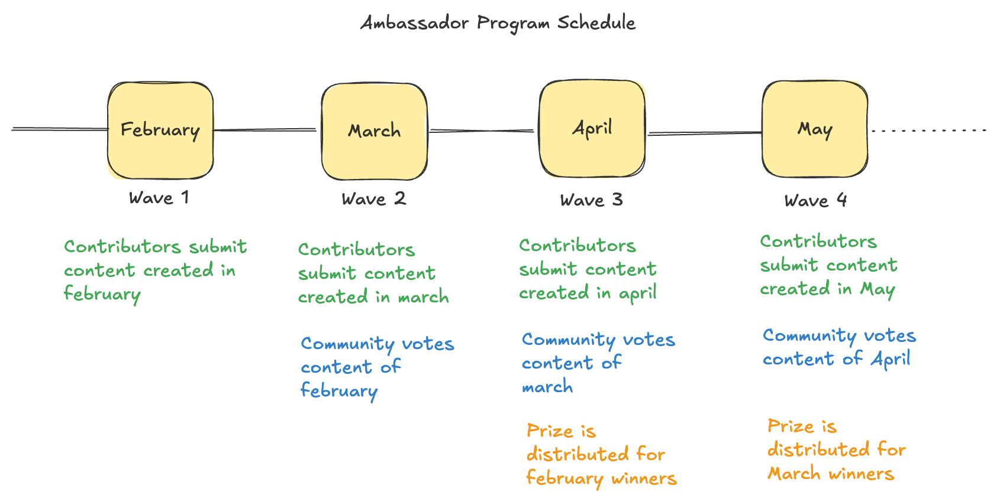
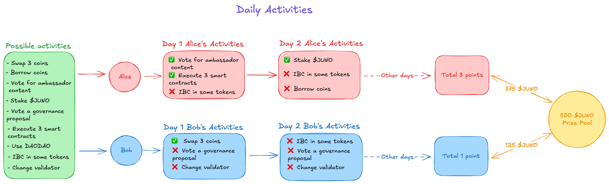

# Juno Roadmap: Proposal 5 - Community Activities

_Note: This proposal is a draft, will be refined after the portal is live_
_Note2: Since most of these activities require a small commitee to handle the programs, we'll run candidatures on the forum to select the members._

## Summary

This proposal seeks budget to run some community activities, to re-unite the community while at the same time give voice and talk about the things build on Juno. Objective is to have good coverage of everything we do, trough social media, blog posts, and more. Additionally we are proposing a set of daily activities that people can do on the [portal](./4-community-dapps.md), to get as much on-chain activity as possible.

## Ambassador program

### Overview

The ambassador program seeks to reward community members who actively promote Juno across social media, blogs, video and other channels.
We propose to allocate a fixed monthly budget for this program, that will be distributed directly to contributors trough a voting system.

- The program will work in waves, one wave each month.
- During each month, contributors can create and publish content
- During each month, contributors are required to fill a form to be eligible for the prize distribution before the end of the month.
- Contributions are initially reviewed by a small committee, just to make sure content is not spam and it follows the guidelines
- At the start of the next month, contributions are published in the Juno Portal for voting
- Each juno staker, can allocate points to every content based on their own like
- At the end of the month votes are closed, and the prize is distributed proportionally to the votes received

Refer to this diagram for better understanding:

### Incentivization

To incentivize community voting, we propose to share a portion of the prize with the people who voted. To avoid random voting, the committee will highlight 3 top contributions based on the quality of the submissions. The voting prize will be awarded only to those who voted for the highlighted content. The goal is to find and vote for the best content.

### Full guidelines

The full ambassador program guidelines and committee members are available [here](../programs/ambassador-program.md).

### Budget

We propose an initial budget of 20,000 JUNO for each wave. Based on the program success, we can modify it to properly match the value generated. The funds are allocated directly to the smart contract handling the program. The sourcecode is available [here](https://github.com/CosmosContracts/).

## Bounty Program

### Overview

The bounty program seeks to reward community members for specific and strategic tasks that are chosen and awarded by a committee. It's different from the ambassador program because all the prizes will not be awarded based on community popularity but rather only discretionally by the committee itself. Additionally, since the bounty list is public, you can know in advance how much each task will pay if done correctly.

Whenever needed, the committee will publish a list of available bounties either in the portal or in a specific GitHub repository. Anyone with experience can apply to fulfill that task. To avoid people working on the same task at the same time, the public page will show if the task is already taken or in progress by someone else.

When a task is completed, it will be submitted to the committee for final review. If approved, the budget will be paid to the bounty hunter.

### Budget

For this program, we propose a one-time budget of 45,000 JUNO. If needed, we can submit another proposal to obtain more budget. Funds will be allocated directly to the committee's DAODAO account.

## Daily activities

### Overview 

One of the key aspects of the portal for it to be successful is having many returning users who do activities on it. While some operations will surely be organic, thanks to the great dApps built on it, we think adding a small flavor of gamification might be one of the killer features of the portal. We propose the implementation of Daily Activities, similar to how MMORPGs work where you need to log in daily to grind materials and farm creatures to get nice prizes.

The daily activities will be coded in the portal itself, and every day 3 of these challenges will be randomly assigned to each user.

Whenever users complete daily activities, they will be rewarded with points. At the end of each week, based on the number of points each user has, a prize will be shared among them.

_Refer to this diagram for better understanding_

Note: The list of possible activities in this diagram is just an example, we are open to hear suggestions about what kind of activities code into the system.

### Budget

We propose a quartely budget of 120,000 $JUNO, which will be allocated directly to the smart contract handling the daily activities. The sourcecode is available [here](https://github.com/CosmosContracts/).

## Conclusion

- Vote YES if you agree to allocate the following budgets for community programs:
  - 20,000 JUNO per wave for the Ambassador Program
  - 45,000 JUNO one-time budget for the Bounty Program 
  - 120,000 JUNO quarterly budget for Daily Activities
- Vote NO if you disagree with allocating these funds for the community programs.
