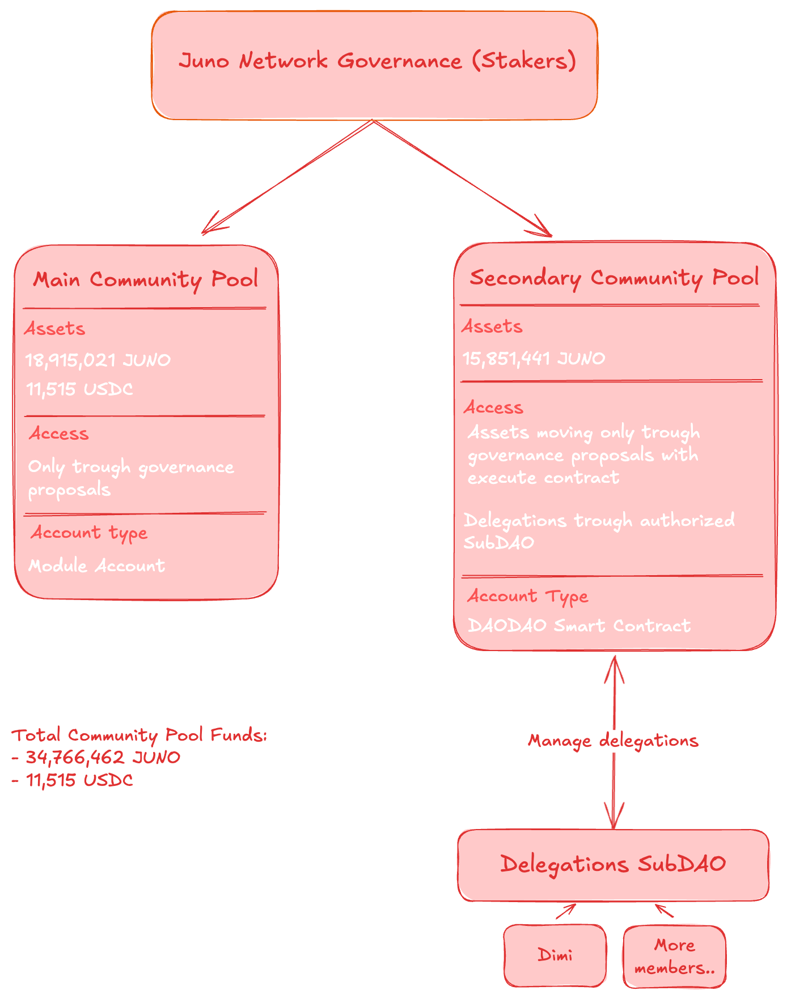

# Delegation Program

With this proposal, we are transferring **5,000,000 JUNO** from the community pool to the [Council SubDAO](https://daodao.zone/dao/juno1nmezpepv3lx45mndyctz2lzqxa6d9xzd2xumkxf7a6r4nxt0y95qypm6c0/treasury). As you may know, the Council SubDAO is currently inactive and has no members. This means the tokens cannot be spent in any way. The only action that can be performed from that account is **delegation**, thanks to an existing authorization granted to the [Delegation SubDAO](https://daodao.zone/dao/juno1ehayefjmlty0zvqdjs2l7tkamtgq3jpuucrjjs568lhapxjcd3xs6rf8ma/home).

Currently, the Delegation SubDAO has only **Dimi** as a member, but more members will be added as we find individuals willing to contribute to the **Reviewer Committee**.

> **Note:** The funds are not at risk, as only delegation transactions can be executed.

## SubDAO Renaming

Since the Council is no longer in use—and since this proposal effectively repurposes it—we propose renaming and restructuring the SubDAOs as follows:

- **Council** → **Secondary Community Pool**
- **Delegations** → Remains unchanged, but will be moved directly under the _Secondary Community Pool_, rather than under the Operations Department.

## Juno Structure recap

To make everything more understandable, this is a diagram of how Juno Network community pool will be structured after this proposal

## The New Program

A total of **15,000,000 JUNO** will be used to launch the new delegation program. A draft is already available [here](https://github.com/CosmosContracts/delegations/pull/3/files).

**tl;dr of the program:**

- Incentivize dApp development
- Support validator infrastructure on both mainnet and testnet
- Encourage content creation

## Conflict of Interest

Since **Kintsugi** will be the main party reviewing delegation applications—and is also a validator applying to the program—we have pre-published the points we intend to assign to ourselves [here](https://github.com/CosmosContracts/delegations/blob/1f6a2df570c853509032135e2cf0ef1baed2f008/policy/delegations.md#kintsugi-validator--conflict-of-interest). This allows the community to review our self-assessment and vote accordingly.

## Vote Options

- **Vote YES**: If you support the new delegation program and agree with sending additional tokens from the community pool to a SubDAO for delegation.
- **Vote NO**: If you don’t support the new program, disagree with its design, or don’t approve of the self-assigned points by Kintsugi.
- **Vote VETO**: If you want to burn my deposit.
- **Vote ABSTAIN** – If you’re unsure or wish to withhold an opinion.
